# AI 輔助專題研究與科學展覽 - 教學簡報大綱 (61頁重構版)

本簡報旨在介紹如何將人工智慧（AI）工具轉化為「智能增強（IA）」的助手，全方位輔助高中師生進行科學專題研究與科展競賽的發想、文獻整理、數據分析及成果展示。

---

Slide 1: Cover
- Slide title: AI 輔助專題研究與科學展覽
- Key points:
  - 講者：麗山高中生物科 林獻升 老師
  - 核心思維：AI 工具在高中專題研究中的定位與價值
  - 從腦力激盪、文獻搜集到圖表製作與海報簡報生成
- Layout role: cover
- Required images:
  - Cover illustration; strict input asset; preserve image style
    

Slide 2: Instructor Profile
- Slide title: 講師簡介：林獻升 老師
- Key points:
  - 臺北市立麗山高中 生物科教師
  - 致力於 AI 輔助教學與跨領域專題指導
  - 引導學生從日常實驗出發，以 AI 實現智能增強 (IA)
- Layout role: concept explanation
- Required images:
  - Profile picture; strict input asset; preserve image
    

Slide 3: Core Concept: AI to IA
- Slide title: 從 AI 到 IA：智能增強的教育實踐
- Key points:
  - AI → IA (Intelligence Amplification，智能增強)
  - 以人類為主體，AI 作為能力放大器
  - 核心應用場景：教學、實驗、導師、行政
- Layout role: concept explanation
- Required images:
  - IA architecture diagram; strict input asset; preserve elements
    

Slide 4: Section Divider: LLM AI 語言模型
- Slide title: 第一單元：LLM AI 語言模型與工具概覽
- Key points:
  - 認識當前主流的 LLM 語言模型
  - 掌握工具特性，選擇合適的 AI 助手
  - 構建專題研究的智能基礎
- Layout role: section divider
- Required images:
  - LLM Logos; strict input asset
    

Slide 5: Mainstream LLM Tools Overview
- Slide title: 主流 LLM 語言模型與專題定位
- Key points:
  - **ChatGPT** (OpenAI)：強於邏輯推論、創意腦力激盪與高階寫作
  - **Microsoft Copilot** (Microsoft)：整合 Office 生態系與 Bing 網頁即時檢索
  - **Google Gemini** (Google)：多模態圖片分析與 Google 生態系深度整合
  - **程式專屬 AI**：自動生成、偵錯並執行程式碼，降低程式繪圖門檻
- Layout role: concept explanation

Slide 6: Section Divider: Research Topics and Ideation
- Slide title: 第二單元：專題研究與題目發想
- Key points:
  - 如何利用 AI 尋找有價值的研究題目
  - 從文獻與實驗中提煉科學問題
  - 打造嚴謹的科展與專題研究起點
- Layout role: section divider
- Required images:
  - Research topic divider; strict input asset
    

Slide 7: Core Tools for Topic Search
- Slide title: 專題研究核心工具組合
- Key points:
  - 腦力激盪與題目發想：ChatGPT, Gemini, Claude
  - 文獻搜尋與實驗設計：Perplexity, Felo search
  - 五大工具相輔相成，覆蓋研究前期的所有需求
- Layout role: concept explanation
- Required images:
  - Tool icons; strict input asset
    

Slide 8: The Golden Triangle of Science Fair Topic Selection
- Slide title: 科展選題的「黃金三角」評估法
- Key points:
  - **科學價值**：研究問題是否具有科學探究意義？是否合乎邏輯？
  - **可行性**：高中實驗室器材是否足夠？實驗時間是否允許？
  - **創新性**：與歷屆得獎作品相比，是否有新的切入點或變因？
  - 利用 AI 針對這三個維度對您的點子進行壓力測試與評估
- Layout role: concept explanation

Slide 9: Prompt Engineering for Topic Ideation
- Slide title: 如何向 AI 提問？專題發想 Prompt 結構
- Key points:
  - **設定角色**：例如「你是一位資深的生物科展指導教授」
  - **提供背景**：提供學生年級、興趣領域、可用的實驗設備
  - **明確任務**：要求提供 5 個探究變因具體、具備可行性的題目
  - **限制條件**：避免過於高深的儀器需求，聚焦於日常可得之耗材
- Layout role: concept explanation

Slide 10: ChatGPT: Brainstorming Research Topics
- Slide title: ChatGPT：科學展覽題目的腦力激盪
- Key points:
  - 應用方式：以對話方式引導學生發想新穎題目
  - 優點：提供發散式的點子與多元的研究視角
  - 範例：輸入興趣領域，要求 ChatGPT 提供 5 個可行的科展方向
- Layout role: concept explanation

Slide 11: Case Study: ChatGPT Brainstorming in Action
- Slide title: 範例解析：ChatGPT 腦力激盪實作
- Key points:
  - 實作對話呈現：學生與 AI 的互動歷程
  - 如何追問：從「我想研究植物」細化到「探討特定波長對水分吸收的影響」
  - 關鍵提示詞與 AI 反饋結果展示
- Layout role: data evidence
- Required images:
  - ChatGPT brainstorming; strict input asset; preserve screen
    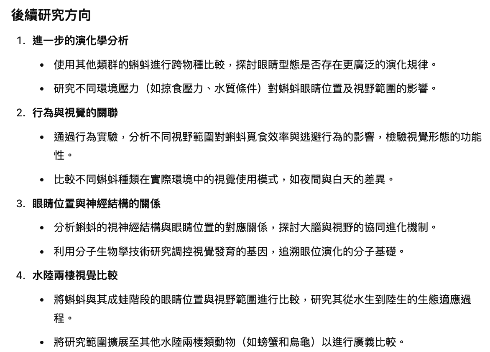

Slide 12: Gemini: Ideation from Biology Experiments
- Slide title: Gemini：從高中生物實驗延伸發想
- Key points:
  - 應用方式：基於高中現有的實驗課內容進行延伸與改良
  - 優點：結合教材，確保實驗具備可行性與器材可得性
  - 範例：從酵母菌發酵實驗，發想變因改良方案
- Layout role: concept explanation

Slide 13: Case Study: Gemini Experiment Ideation in Action
- Slide title: 範例解析：Gemini 生物實驗發想實作
- Key points:
  - 展示如何基於課堂實驗進行「探究與實作」延伸
  - 變因改良發想：改變溫度、pH值、或基質濃度
  - AI 提供之可行性評估與實驗設計初稿展示
- Layout role: data evidence
- Required images:
  - Gemini biology ideation; strict input asset; preserve screen
    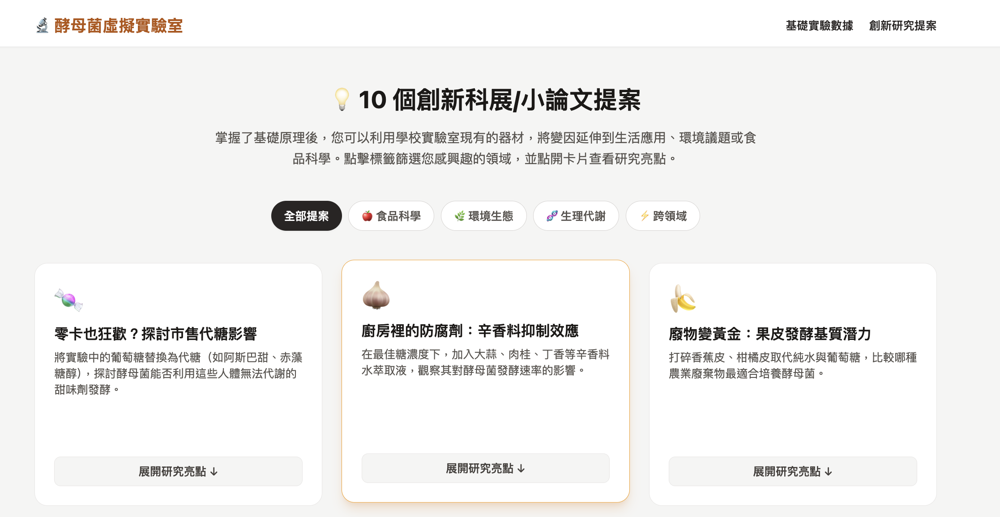

Slide 14: Claude: Finding Ideas from Past Research
- Slide title: Claude：從歷屆科展報告提煉研究靈感
- Key points:
  - 應用方式：將歷屆科展 PDF 上傳給 Claude 分析其局限性與未來展望
  - 優點：站在巨人的肩膀上，尋求改進或後續研究題目
  - 範例：分析得獎作品，找出未解決的變因
- Layout role: concept explanation

Slide 15: Case Study: Claude Analyzing Past Science Fair Reports
- Slide title: 範例解析：Claude 分析歷屆報告實作
- Key points:
  - 展示如何上傳歷屆科展 PDF 進行深度精讀
  - 指導 AI 找出「研究限制」與「未來研究方向」
  - 從已發表的文獻中尋找尚未被完全探討的科學漏洞
- Layout role: data evidence
- Required images:
  - Claude past research analysis; strict input asset; preserve screen
    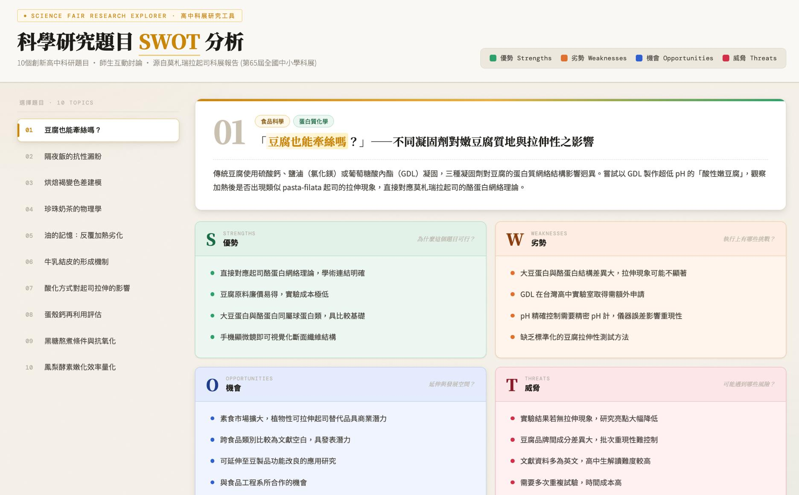

Slide 16: Perplexity: From Search to Experimental Design
- Slide title: Perplexity：聯網文獻搜尋與實驗架構設計
- Key points:
  - 應用方式：輸入研究問題，直接進行學術文獻搜尋與摘要
  - 優點：即時生成附有引用的研究設計建議
  - 範例：搜尋特定植物萃取物的抑菌實驗步驟
- Layout role: concept explanation

Slide 17: Case Study: Perplexity Experimental Design in Action
- Slide title: 範例解析：Perplexity 設計實驗實作
- Key points:
  - 展示即時聯網檢索學術文獻的能力
  - 自動生成附帶來源引用 (Citation) 的實驗指南
  - 幫助學生快速掌握標準實驗方法與濃度設定
- Layout role: data evidence
- Required images:
  - Perplexity research design; strict input asset; preserve screen
    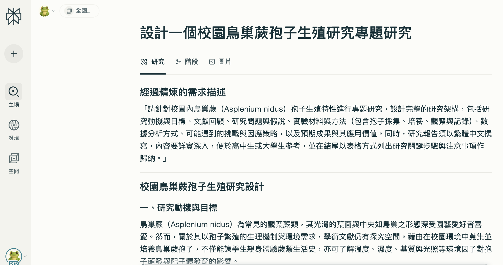

Slide 18: Felo Search: Semantic Search for Research
- Slide title: Felo Search：跨語言學術搜尋與設計
- Key points:
  - 應用方式：使用自然語言搜尋全球的學術資料庫
  - 優點：提供自動翻譯與結構化的實驗設計藍圖
  - 範例：快速整理國外相關研究的實驗變因與對照組設定
- Layout role: concept explanation

Slide 19: Case Study: Felo Search Interface in Action
- Slide title: 範例解析：Felo Search 介面與搜尋實作
- Key points:
  - 跨越語言障礙：以中文輸入即可檢索全球英文頂尖論文
  - 系統化整理：自動提煉出相關論文的核心結論
  - 適合前期背景文獻調研的利器
- Layout role: data evidence
- Required images:
  - Felo search interface; strict input asset; preserve screen
    

Slide 20: Felo AI: Literature Retrieval and Organization
- Slide title: Felo AI：文獻搜尋與多模式整理
- Key points:
  - 特色：支援多種檢索模式（學術、社交、即時）
  - 優點：能自動分類文獻觀點，整理出重點摘要
  - 範例：針對某一科學主題進行文獻分類整理
- Layout role: concept explanation

Slide 21: Case Study: Felo AI Literature Organization in Action
- Slide title: 範例解析：Felo AI 文獻整理實作
- Key points:
  - 展示多模式檢索的文獻庫對比
  - 學術專用模式：過濾垃圾資訊，聚焦同儕審查論文
  - AI 自動將文獻分類並產出主題表格之實作畫面
- Layout role: data evidence
- Required images:
  - Felo AI literature search; strict input asset; preserve screen
    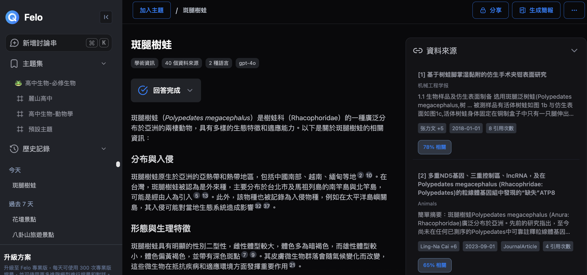

Slide 22: Felo AI: Automating Experimental Steps
- Slide title: Felo AI：基於文獻自動生成實驗步驟
- Key points:
  - 應用方式：整合多篇論文的步驟，輸出可行的實驗流程
  - 優點：減少學生自行拼湊實驗步驟的錯誤率
  - 範例：自動產出植物色素層析實驗步驟
- Layout role: concept explanation

Slide 23: Case Study: Felo AI Generating Experimental Steps
- Slide title: 範例解析：Felo AI 步驟生成實作
- Key points:
  - 展示文檔與網路資料的處理與分析成果
  - 自動生成包含「步驟、耗材、注意事項」的完整實驗手冊
  - 讓學生能直接在實驗室進行初步測試的操作畫面
- Layout role: data evidence
- Required images:
  - Felo AI experiment design; strict input asset; preserve screen
    

Slide 24: Deep Research: AI-powered Deep Literature Review
- Slide title: Deep Research：AI 深度調研與文獻探討
- Key points:
  - 工具：Felo Search 與 Perplexity
  - 特色：AI 會自動執行多步驟搜尋、追蹤文獻引用鏈結
  - 專題應用：生成結構完整、文獻引用詳實的文獻探討初稿
- Layout role: concept explanation
- Required images:
  - Deep Research workflow; strict input asset
    

Slide 25: ChatGPT: Deep Investigation to Report
- Slide title: ChatGPT：從深度文獻調研到專業報告
- Key points:
  - 應用方式：彙整多篇文獻內容，由 ChatGPT 撰寫報告初稿
  - 優點：文字流暢、結構嚴謹，符合學術報告格式
  - 範例：自動生成引言、研究動機與背景說明
- Layout role: data evidence
- Required images:
  - ChatGPT report generation; strict input asset; preserve screen
    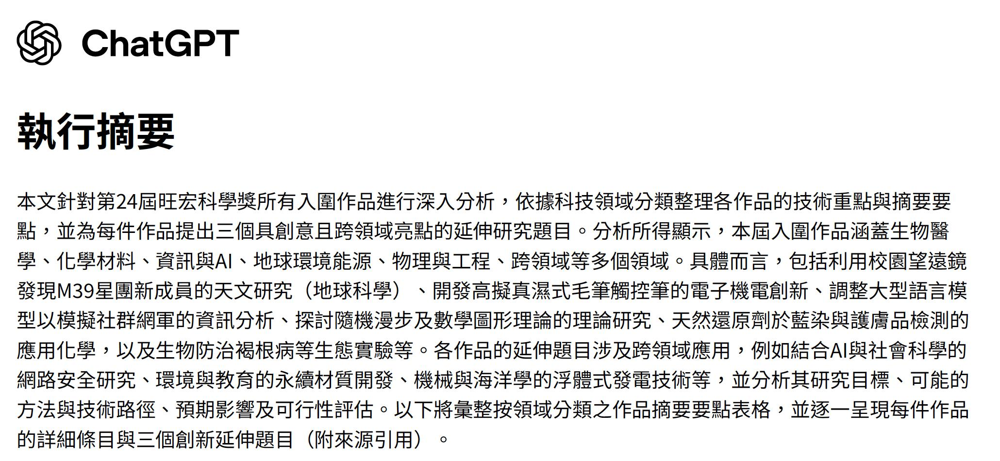

Slide 26: Gemini: Pre-evaluating Research Plans
- Slide title: Gemini：研究計畫的可行性評估
- Key points:
  - 應用方式：將撰寫好的實驗設計給 Gemini 審查
  - 優點：事先指出潛在的安全風險、實驗漏洞或控制變因不足
  - 範例：審查化學實驗的安全防護與廢棄物處理
- Layout role: data evidence
- Required images:
  - Gemini plan evaluation; strict input asset; preserve screen
    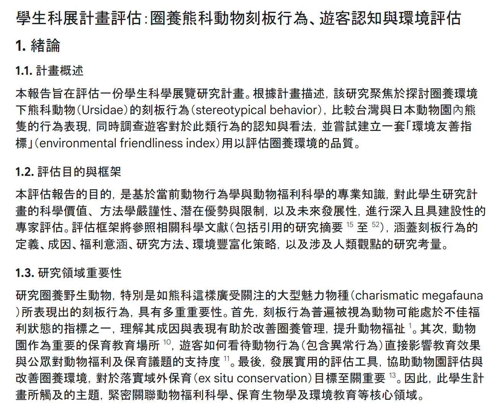

Slide 27: Gemini: In-depth Analysis of Science Fair Reports
- Slide title: Gemini：科展報告的深度診斷與優化
- Key points:
  - 應用方式：上傳學生的科展報告草稿，要求進行邏輯與結構審查
  - 優點：指出推論不嚴謹之處，並提供具體的修改建議
  - 範例：評估數據是否能支持結論
- Layout role: data evidence
- Required images:
  - Gemini report analysis; strict input asset; preserve screen
    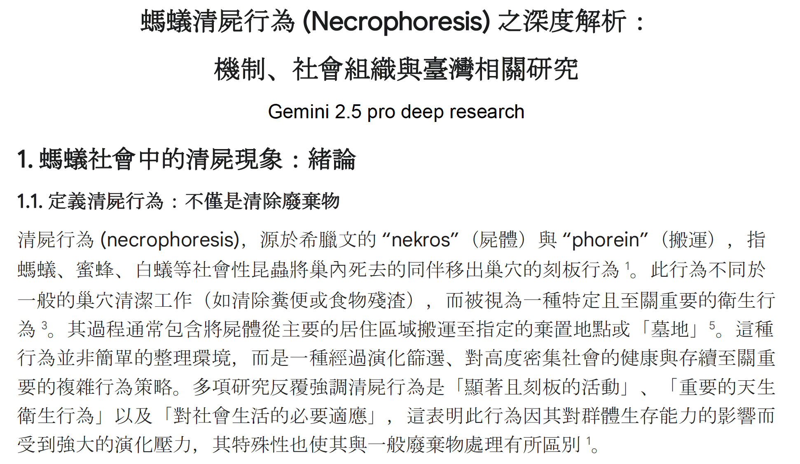

Slide 28: Section Divider: Research Data Organization
- Slide title: 第三單元：研究文獻與資料整理
- Key points:
  - 解決文獻凌亂、難以追蹤的痛點
  - 建立個人的科學研究知識庫
  - 善用 Notion 與 NotebookLM 進行文獻精讀
- Layout role: section divider
- Required images:
  - Data organization divider; strict input asset
    

Slide 29: The Pain Points of Literature Management
- Slide title: 文獻管理的痛點與知識管理思維
- Key points:
  - **痛點一**：下載了數十篇 PDF 論文，忘記每篇的核心結論與數據
  - **痛點二**：撰寫文獻引用時，找不到原始文檔的出處
  - **解決思維**：建立「單一真理來源 (Single Source of Truth)」的數位研究筆記
  - 以 AI 輔助快速自動化擷取文獻欄位與產生大綱
- Layout role: concept explanation

Slide 30: Notion: Collecting and Managing Literature
- Slide title: Notion：系統化搜集與整理研究文獻
- Key points:
  - 應用方式：利用 Notion 資料庫管理文獻的標題、作者、標籤與狀態
  - 優點：結構清晰，可隨時檢索與分類
  - 範例：建立「科展文獻管理資料庫」
- Layout role: data evidence
- Required images:
  - Notion literature collection; strict input asset; preserve screen
    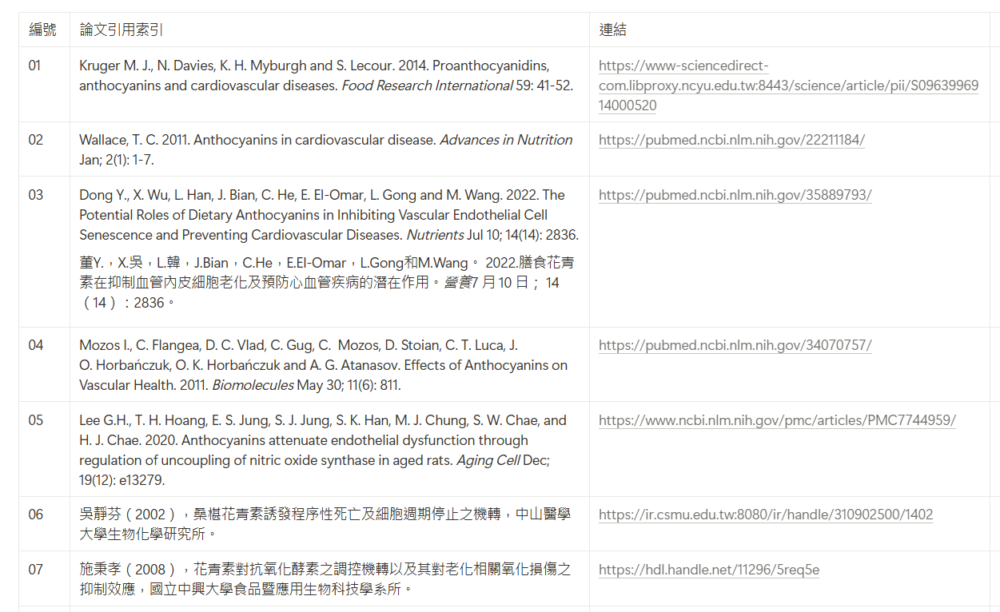

Slide 31: Notion: Summarizing Literature Key Points
- Slide title: Notion：提煉文獻核心重點與研究方法
- Key points:
  - 應用方式：在 Notion 頁面中記錄每篇文獻的摘要、圖表與心得
  - 優點：便於日後撰寫文獻探討時快速引用
  - 範例：填寫文獻摘要模板與實驗變因對照表
- Layout role: data evidence
- Required images:
  - Notion literature summary; strict input asset; preserve screen
    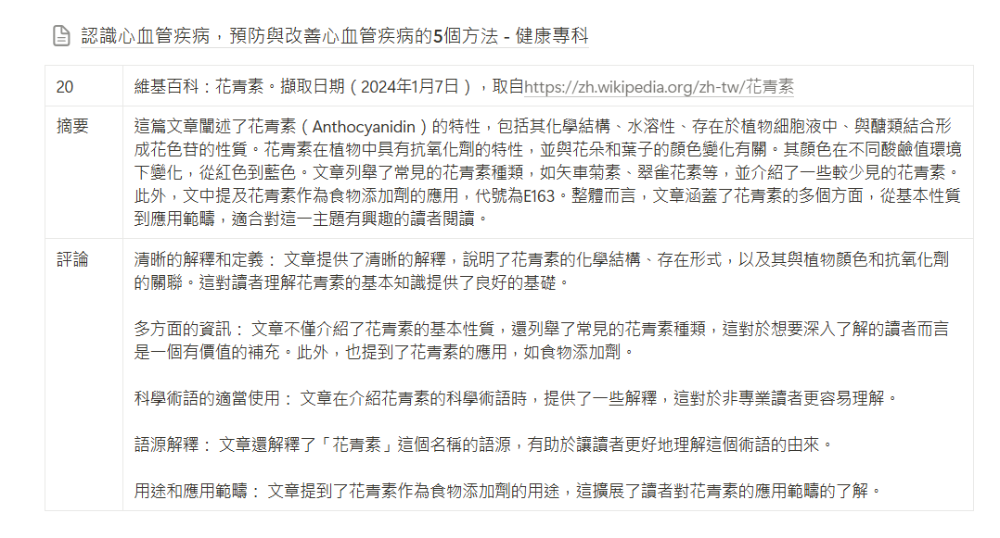

Slide 32: NotebookLM: Reading Research Literature
- Slide title: NotebookLM：專屬文獻閱讀與理解助理
- Key points:
  - 開發商：Google
  - 應用方式：上傳多篇 PDF 論文，建立主題筆記本
  - 優點：只針對您上傳的文獻進行回答，有效避免 AI 幻覺
- Layout role: data evidence
- Required images:
  - NotebookLM reading; strict input asset; preserve screen
    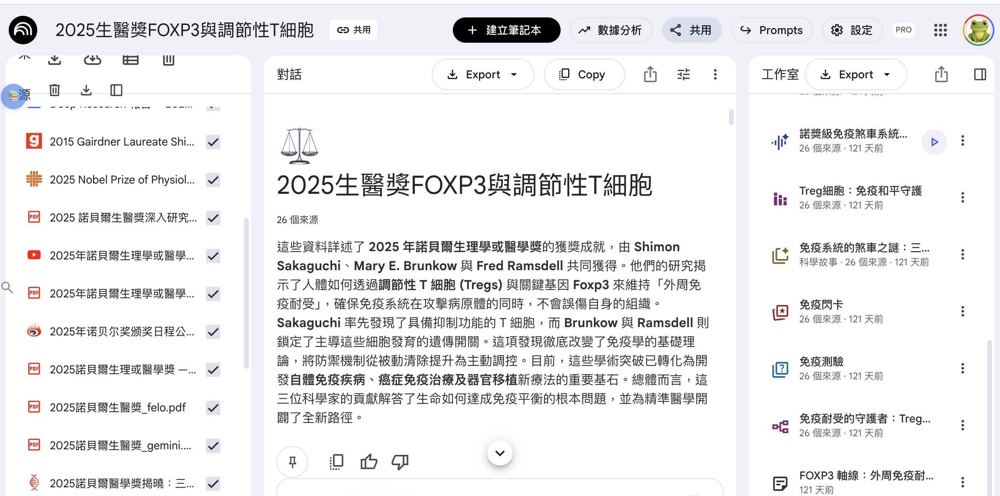

Slide 33: NotebookLM: Finding Follow-up Research Ideas
- Slide title: NotebookLM：從文獻中挖掘後續研究題目
- Key points:
  - 應用方式：提問「這些文獻中還有哪些未解決的問題？」
  - 優點：精準找出研究空白，作為新題目的發想來源
  - 範例：從 5 篇植物生理學論文中發想科展題目
- Layout role: data evidence
- Required images:
  - NotebookLM idea generation; strict input asset; preserve screen
    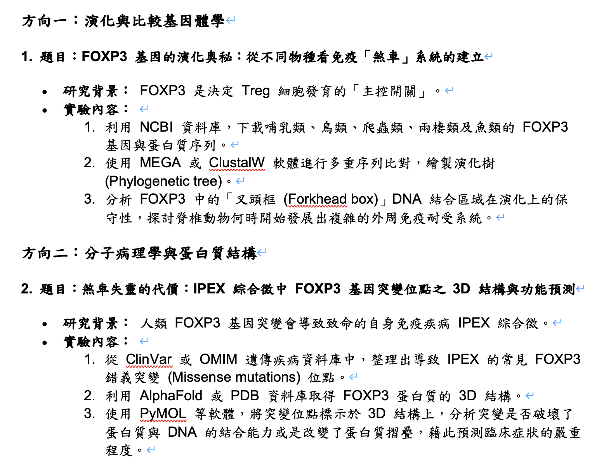

Slide 34: NotebookLM: Guide to NotebookLM
- Slide title: NotebookLM：建構您的專屬研究工作室
- Key points:
  - 特色：支援多種文檔輸入，生成大綱與音訊簡報
  - 專題應用：將複雜的研究文獻一鍵轉化為雙人對話 Podcast，用聽的學英文文獻
  - 快速產出研究摘要指引
- Layout role: concept explanation
- Required images:
  - NotebookLM guide; strict input asset
    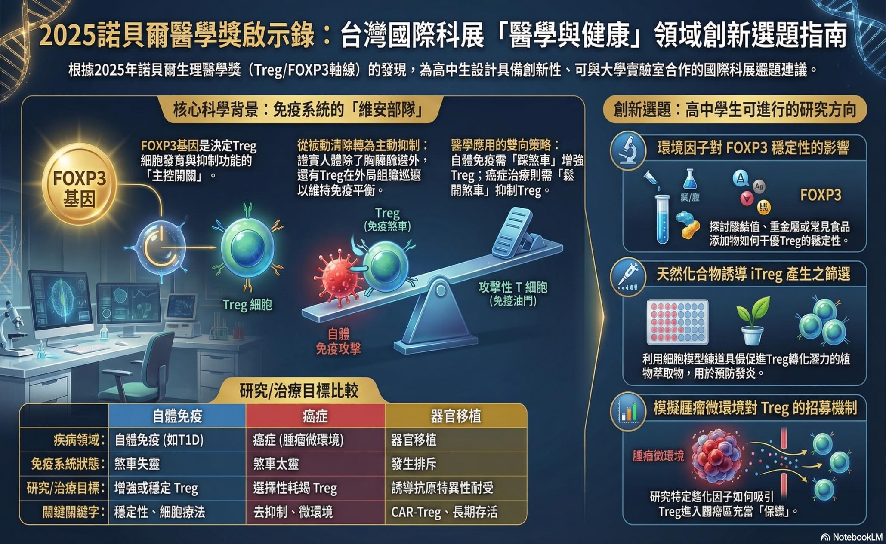

Slide 35: Gemini Canvas: Multi-modal Output Conversion
- Slide title: Gemini Canvas：將研究轉換為網頁與語音
- Key points:
  - 應用方式：利用 Canvas 將報告快速改寫為 HTML 網頁
  - 優點：支援一鍵轉為語音發表，方便多元展示
  - 範例：將科展摘要轉化為網頁展示互動成果
- Layout role: data evidence
- Required images:
  - Gemini Canvas conversion; strict input asset; preserve screen
    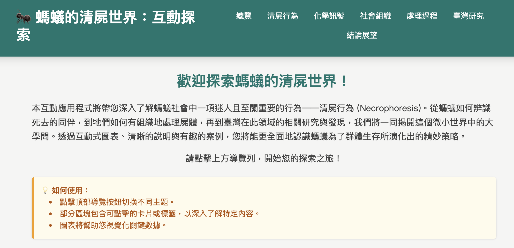

Slide 36: Section Divider: Statistics and Charting
- Slide title: 第四單元：數據統計與圖表製作
- Key points:
  - 如何用 AI 處理雜亂的實驗數據
  - 繪製符合學術規範的精美科學圖表
  - 掌握統計檢定，確保數據的顯著性
- Layout role: section divider
- Required images:
  - Charting divider; strict input asset
    

Slide 37: Rules and Aesthetics for Scientific Charting
- Slide title: 科學圖表繪製規範與美化原則
- Key points:
  - **清晰度**：坐標軸必須有明確的名稱與物理單位
  - **資料完整度**：重複實驗必須包含標準差或標準誤的「誤差線 (Error Bars)」
  - **配色美學**：使用低飽和度、學術感強的配色，避免使用過於刺眼的紅綠藍原色
  - 使用 Python (Matplotlib / Seaborn) 做圖能達到出版級別的品質
- Layout role: concept explanation

Slide 38: ChatGPT: Data Analysis and Chart Generation
- Slide title: ChatGPT：實驗數據統計與圖表生成
- Key points:
  - 應用方式：將 Excel 數據上傳，用對話指令進行分析與做圖
  - 優點：支援 Python 的 Advanced Data Analysis
  - 範例：繪製實驗組與對照組的長條圖並加上誤差線
- Layout role: data evidence
- Required images:
  - ChatGPT data analysis; strict input asset; preserve screen
    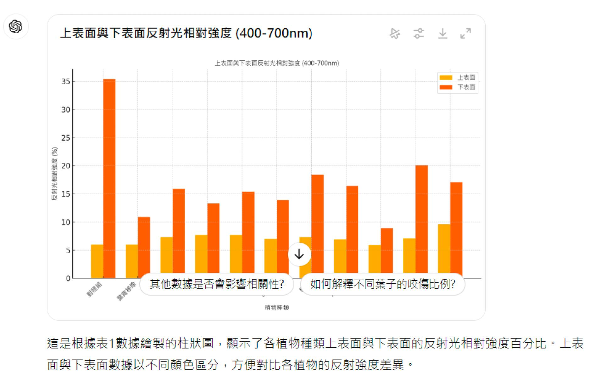

Slide 39: Gemini: Data Analysis and Charting
- Slide title: Gemini：實驗數據分析與做圖
- Key points:
  - 應用方式：上傳數據，讓 Gemini 分析數據趨勢並產出 Python 繪圖代碼
  - 優點：繪圖風格簡潔、對大數據集處理能力佳
  - 範例：分析溫度與酵素活性的關係，繪製折線圖
- Layout role: data evidence
- Required images:
  - Gemini data charting; strict input asset; preserve screen
    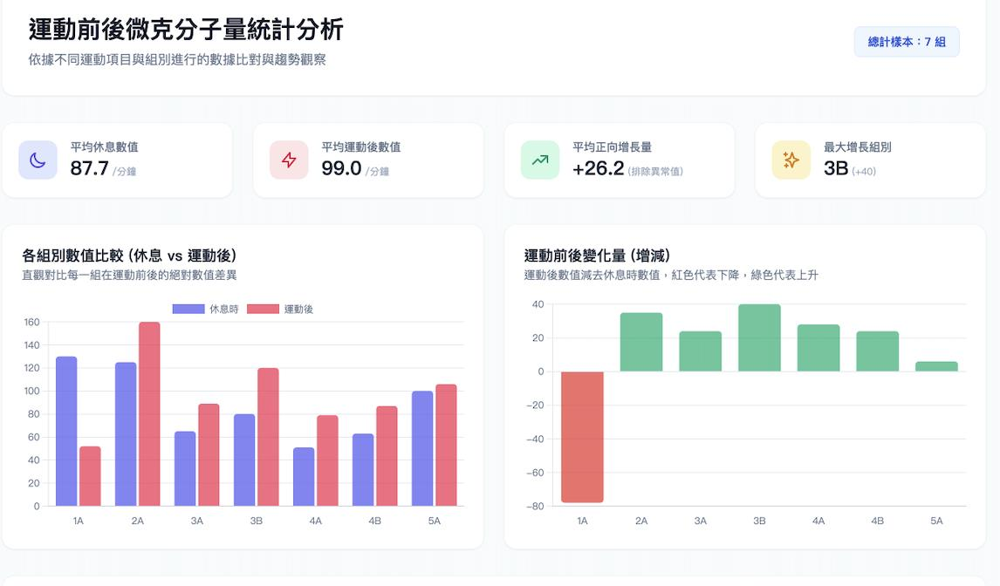

Slide 40: Gemini: Data Statistical Analysis
- Slide title: Gemini：實驗數據的統計檢定
- Key points:
  - 應用方式：要求 Gemini 進行 t 檢定、ANOVA 分析
  - 優點：自動解釋統計顯著性（p 值），並給出結論
  - 範例：檢定兩種肥料對植物生長高度的影響是否有顯著差異
- Layout role: data evidence
- Required images:
  - Gemini statistical analysis; strict input asset; preserve screen
    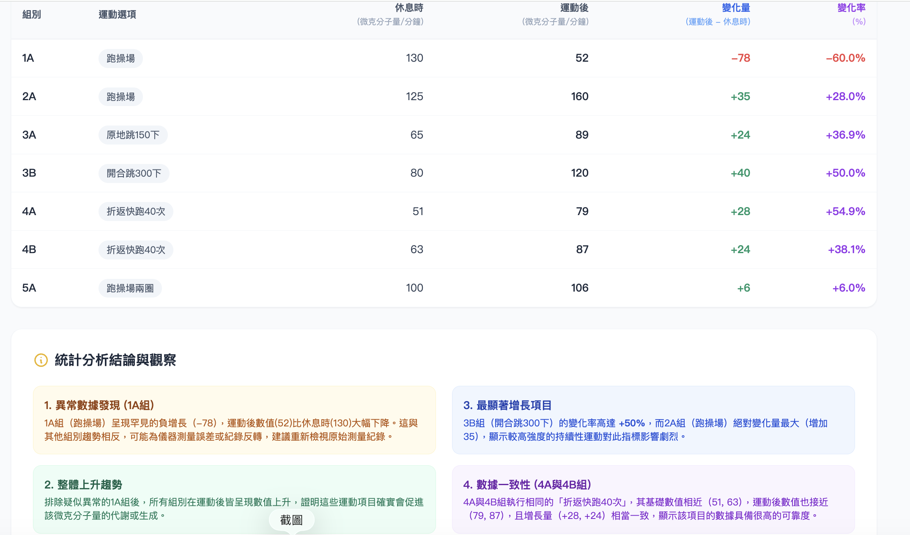

Slide 41: Gemini Canvas: Code Generation for Web Apps
- Slide title: Gemini：使用 Canvas 生成數據互動網頁
- Key points:
  - 應用方式：用自然語言描述，讓 Gemini 生成 JavaScript/HTML 網頁
  - 優點：建立互動式的數據模擬器或計算工具，為科展加分
  - 範例：生成一個酵母菌生長曲線的互動模擬網頁
- Layout role: data evidence
- Required images:
  - Gemini Canvas app generation; strict input asset; preserve screen
    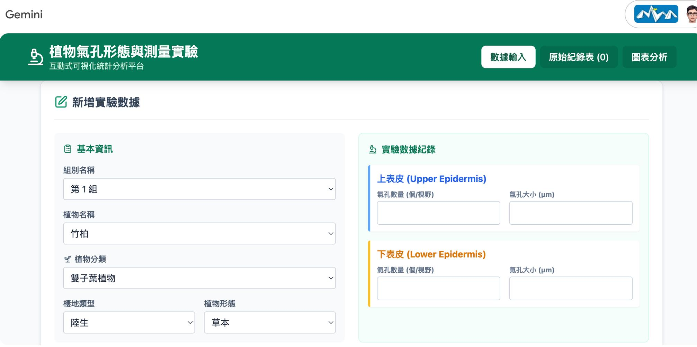

Slide 42: Data Visualization Example
- Slide title: 科學圖表視覺化示例
- Key points:
  - 展示符合科展規範的統計圖表
  - 圖表要素：清晰的坐標軸標籤、單位、圖例與標題
  - 拒絕雜亂，用精美的數據可視化說服評審
- Layout role: data evidence
- Required images:
  - Chart example; strict input asset
    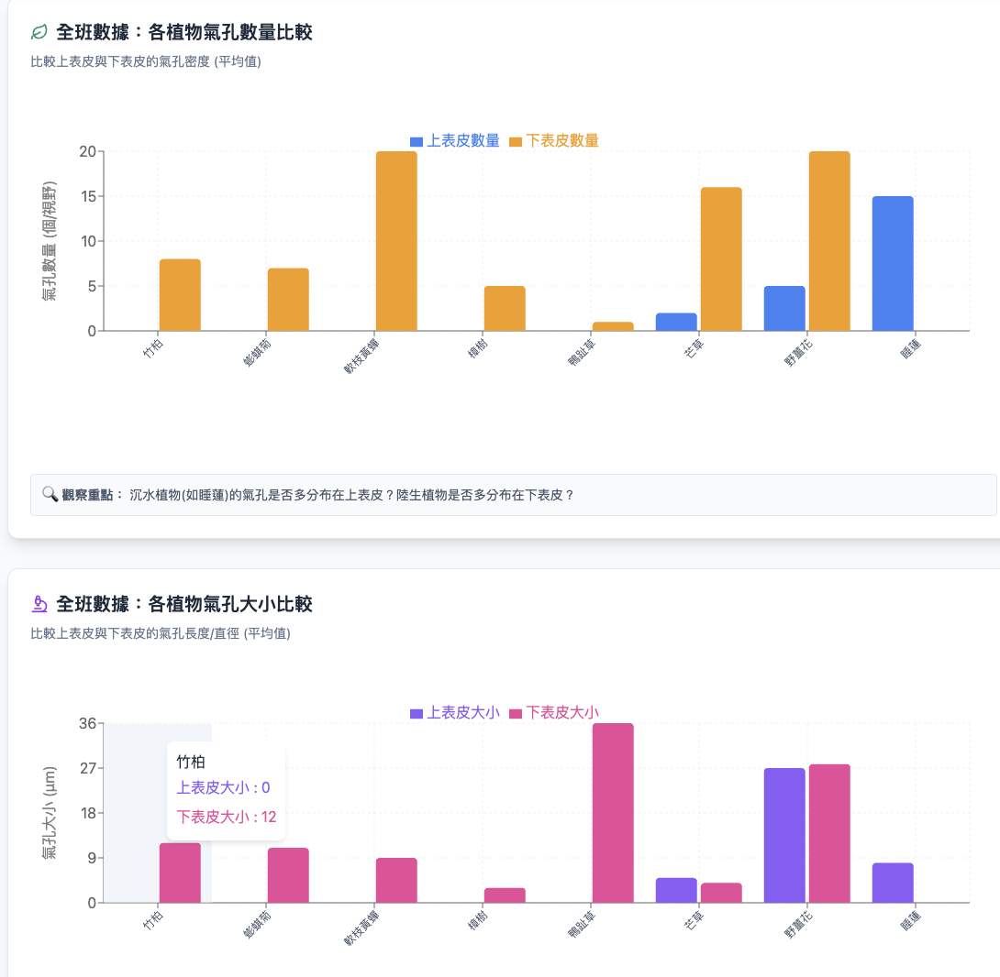

Slide 43: Claude: Powerful Programming Capabilities
- Slide title: Claude：強大的程式撰寫與數據處理
- Key points:
  - 特色：代碼生成品質極高，邏輯縝密
  - 專題應用：撰寫複雜的 Python 數據清理與統計分析腳本
  - 適合需要進行大量程式建模的科展作品
- Layout role: data evidence
- Required images:
  - Claude code generation; strict input asset; preserve screen
    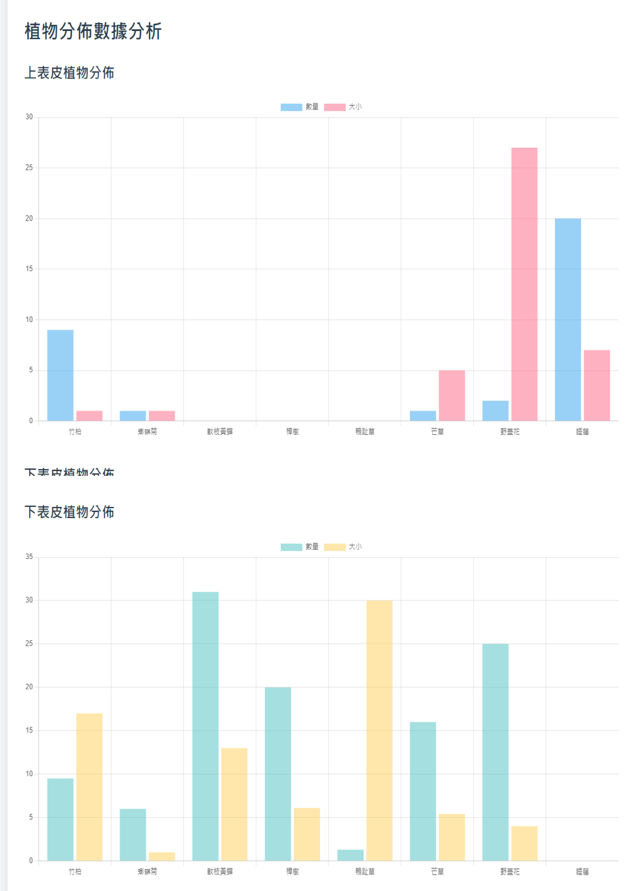

Slide 44: Claude Artifacts: Interactive JavaScript Coding
- Slide title: Claude.AI：利用 Artifacts 即時呈現互動程式
- Key points:
  - 特色：在右側視窗直接執行並呈現 HTML/JS 互動應用
  - 專題應用：展示演算法模擬、基因序列比對工具的運作過程
  - 提升專題研究的互動性與視覺吸引力
- Layout role: data evidence
- Required images:
  - Claude Artifacts interface; strict input asset; preserve screen
    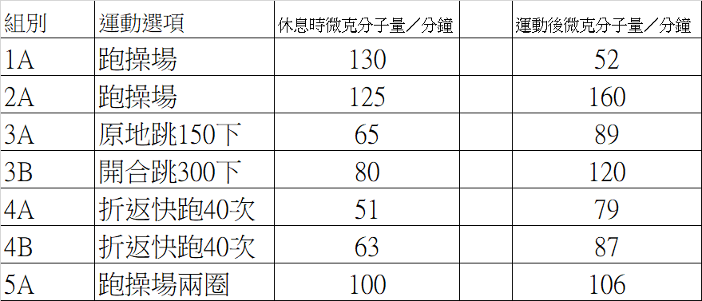

Slide 45: Claude: Data Analysis Line Chart
- Slide title: Claude：實驗數據分析與折線圖繪製
- Key points:
  - 應用方式：利用 Claude 編寫 Matplotlib 繪圖程式，呈現趨勢
  - 優點：圖表細節調整精確，配色符合學術美感
  - 範例：繪製不同時間點的細菌菌落數變化
- Layout role: data evidence
- Required images:
  - Claude line chart; strict input asset; preserve screen
    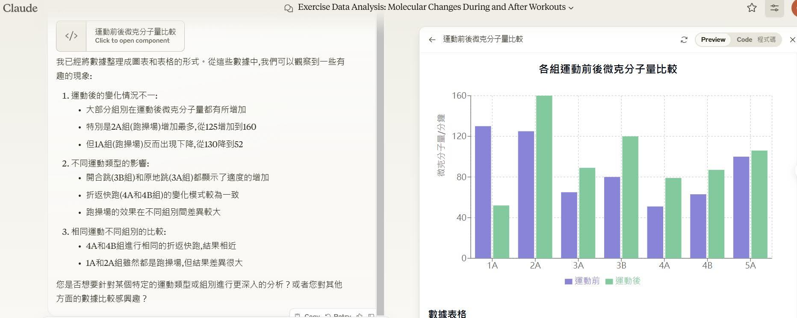

Slide 46: Claude: Data Analysis Scatter Plot
- Slide title: Claude：實驗數據分析與散佈圖/長條圖
- Key points:
  - 應用方式：繪製散佈圖以進行相關性分析，或長條圖進行組間比較
  - 優點：能一併輸出 R^2 與逆合曲線方程式
  - 範例：分析葉片長度與寬度的相關性
- Layout role: data evidence
- Required images:
  - Claude scatter plot; strict input asset; preserve screen
    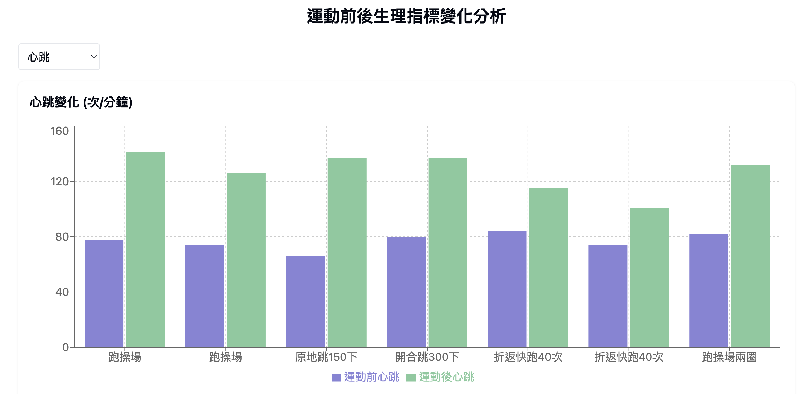

Slide 47: Practical Guide: Prompting Claude for Scientific Charting
- Slide title: 實作指南：引導 Claude 進行科學做圖
- Key points:
  - **提供資料格式**：給出 CSV 欄位名稱與前幾筆資料
  - **指定繪圖庫**：要求使用 `matplotlib` 與 `seaborn` 庫
  - **設定樣式指令**：指定「使用 Arial 字體、設定 DPI=300、無框線樣式」
  - **要求完整代碼**：請 AI 輸出可直接執行的完整 Python 程式碼，拒絕片段
- Layout role: concept explanation

Slide 48: Julius.AI: Professional Data Analysis
- Slide title: Julius.AI：專為數據分析而生的 AI
- Key points:
  - 特色：專門處理數據表格，自動生成精美圖表
  - 專題應用：進行高級統計分析，如多元線性回歸、主成分分析 (PCA)
  - 適用於高階科展或大學專題的複雜數據處理
- Layout role: data evidence
- Required images:
  - Julius.AI charting; strict input asset; preserve screen
    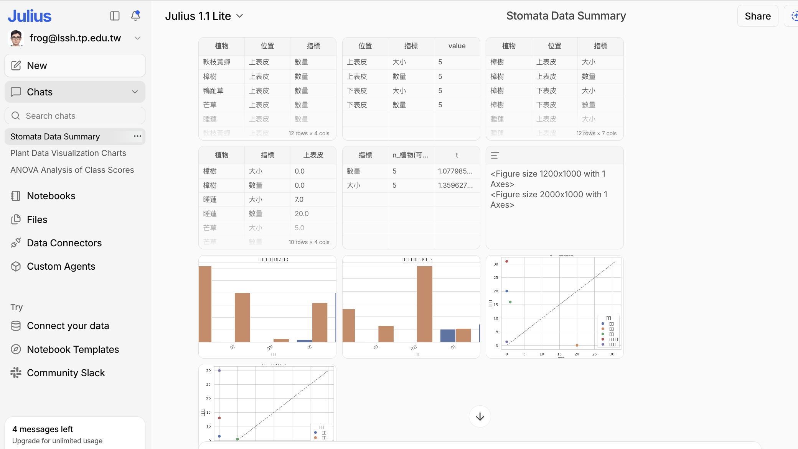

Slide 49: NotebookLM Workspace: AI Infographics and Slides
- Slide title: NotebookLM：從文獻直接產出簡報大綱
- Key points:
  - 應用方式：利用內建的研究指南功能，快速梳理簡報邏輯
  - 優點：緊扣文獻，結構化輸出
  - 讓學生能快速整理出口頭報告的架構
- Layout role: data evidence
- Required images:
  - NotebookLM workspace; strict input asset
    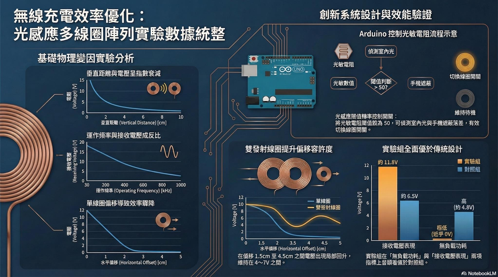

Slide 50: NotebookLM Workspace: Creating Slide Outlines
- Slide title: NotebookLM：文獻工作室的資訊可視化
- Key points:
  - 應用方式：利用文檔生成摘要、FAQ，進而轉化為資訊圖表 (Infographics) 大綱
  - 輔助學生進行科展海報的版面規劃與邏輯梳理
  - 提高科學傳播的效率
- Layout role: data evidence
- Required images:
  - NotebookLM workspace detailed; strict input asset
    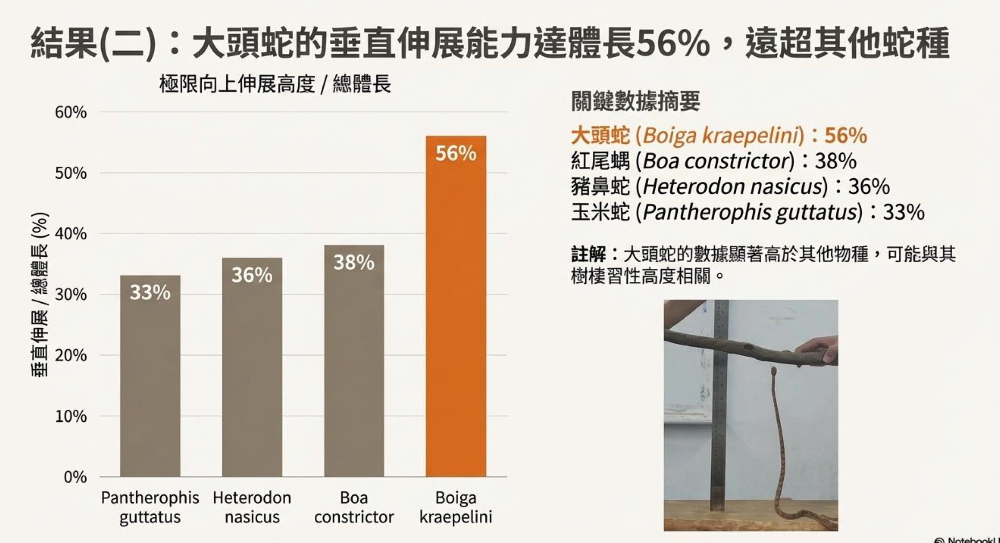

Slide 51: Compliant Data Cleaning and Outlier Handling
- Slide title: 科展數據清理與異常值處理原則
- Key points:
  - **誠實記錄**：不可為了支持假設而隨意刪除不符合預期的數據
  - **異常值定義**：使用統計學方法（如 1.5 倍 IQR 規則）定義異常值
  - **AI 輔助**：利用 AI 撰寫代碼檢測異常值，但必須在報告中註明處理原因
  - 確保數據分析的可重複性 (Reproducibility)
- Layout role: concept explanation

Slide 52: AI-assisted p-value Interpretation
- Slide title: 數據顯著性分析 (p值) 的 AI 判讀
- Key points:
  - **p < 0.05**：在統計學上具有顯著差異，代表實驗效果並非偶然
  - **AI 角色**：協助撰寫統計檢定程式，並初步解讀檢定結果
  - **解讀盲點**：顯著差異不代表因果關係，必須結合生物學原理解釋
  - 指導學生利用 AI 進行多重比較 (Post-hoc test) 的雙重驗證
- Layout role: concept explanation

Slide 53: Section Divider: Presentation and Poster Design
- Slide title: 第五單元：簡報設計與海報生成
- Key points:
  - 將研究成果轉化為吸睛的視覺呈現
  - 善用 AI 快速生成簡報初稿與排版
  - 提升科展口頭發表與海報展示的說服力
- Layout role: section divider
- Required images:
  - Presentation design divider; strict input asset
    

Slide 54: Layout and Visual Flow for Science Fair Posters
- Slide title: 科展海報的版面結構與視覺流向
- Key points:
  - **標準三欄式佈局**：左欄為研究動機與方法，中欄為核心數據圖表，右欄為結論與討論
  - **視覺重量**：大圖表置於中心，吸引評審目光
  - **閱讀動線**：由左至右、由上至下，引導評審順暢閱讀
  - 利用 AI 簡報工具先行輸出局部區塊的資訊圖表
- Layout role: concept explanation

Slide 55: Gemini: Scientific Presentation Outlining
- Slide title: Gemini：科學研究簡報的邏輯規劃
- Key points:
  - 應用方式：給予研究摘要，要求 Gemini 生成 10 頁科學簡報大綱
  - 優點：能以學術研究的標準邏輯（動機、方法、結果、討論）進行編排
  - 節省學生摸索簡報架構的時間
- Layout role: data evidence
- Required images:
  - Gemini presentation draft; strict input asset; preserve screen
    

Slide 56: Gamma: Rapid Presentation Generation
- Slide title: Gamma：文獻整理報告的 AI 快速生成
- Key points:
  - 特色：輸入主題或大綱，AI 自動生成整份排版美觀的簡報
  - 優點：排版極具現代感，支援卡片式版面
  - 適合用於每週研究進度匯報的快速投影片製作
- Layout role: data evidence
- Required images:
  - Gamma presentation; strict input asset; preserve screen
    

Slide 57: Canva AI: Design and Layout Assistant
- Slide title: Canva AI：設計感十足的簡報生成
- Key points:
  - 特色：結合 Canva 豐富的範本庫與 Magic Design AI
  - 應用方式：快速調整簡報配色、字體與插圖風格
  - 適合用於需要高視覺質感、科普性質的專題演講
- Layout role: data evidence
- Required images:
  - Canva AI interface; strict input asset; preserve screen
    

Slide 58: Felo AI: Product and Project Slides
- Slide title: Felo AI：快速生成作品與專題簡報
- Key points:
  - 特色：專注於將文檔一鍵轉為簡報投影片
  - 優點：能根據文檔邏輯自動配圖與排版
  - 幫助學生快速整理出研究計畫的展示大綱
- Layout role: data evidence
- Required images:
  - Felo AI slides; strict input asset; preserve screen
    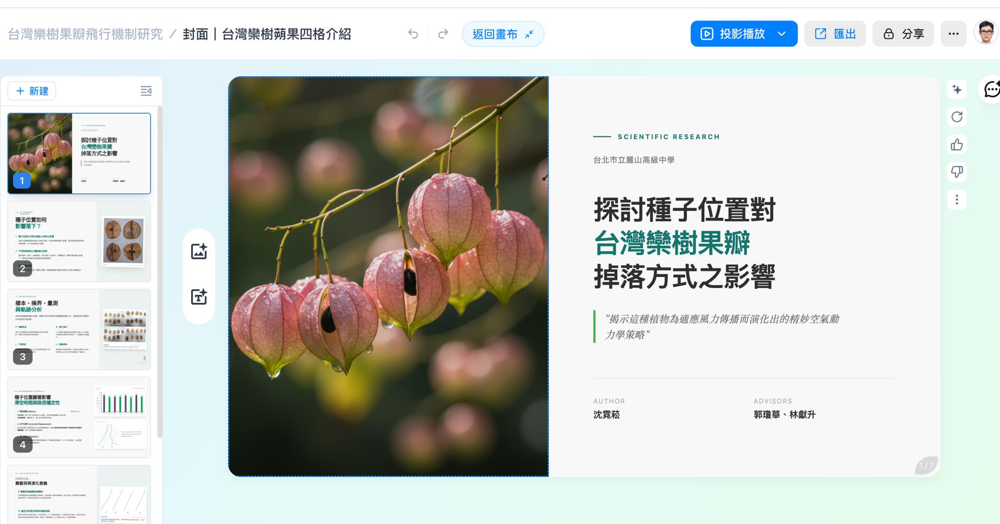

Slide 59: Skywork: Slide Generator
- Slide title: Skywork：簡報自動生成工具
- Key points:
  - 特色：快速將長文整理、提煉成投影片頁面
  - 專題應用：處理複雜的學術論文，產出結構化的導讀簡報
  - 輔助文獻閱讀報告的製作
- Layout role: data evidence
- Required images:
  - Skywork interface; strict input asset; preserve screen
    

Slide 60: Academic Ethics and AI Use Declaration in Science Fairs
- Slide title: 科展中的 AI 學術倫理與使用聲明
- Key points:
  - **揭露原則**：誠實申報 AI 在選題、文獻整理、程式撰寫與排版中的使用範圍
  - **主體性**：實驗必須由學生親自執行，AI 僅扮演輔助增強的角色
  - **責任自負**：學生必須對簡報中的所有數據與文字的真實性負完全責任
  - 範例：如何在報告附錄中撰寫「AI 工具使用說明」
- Layout role: concept explanation

Slide 61: Conclusion and Q&A
- Slide title: 結語與討論：開啟您的 AI 輔助專題研究之旅
- Key points:
  - AI 是工具 (IA)，人類的科學思維與探究精神才是核心
  - 遵守學術倫理，誠實標註 AI 在研究中的使用範圍
  - Q&A：歡迎交流與討論！
- Layout role: closing
- Required images:
  - Closing illustration; strict input asset
    
